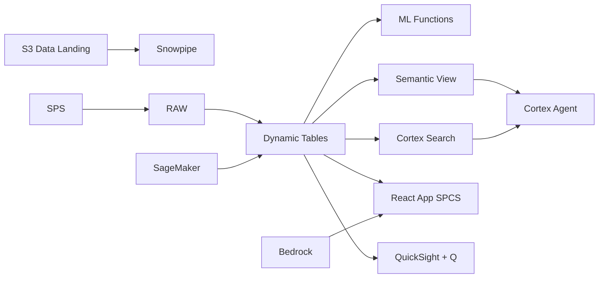

# Mining ESG & Sustainability

ESG compliance and sustainability reporting for Indonesia's nickel mining industry — Dynamic Tables aggregate emissions and social impact metrics, Cortex AI generates GRI-aligned narratives from operational data.

## Architecture

Indonesia's nickel mining boom has attracted US$33B in investment, but ESG scrutiny is intensifying as EV OEMs demand responsible sourcing. A VP Sustainability must track emissions, water discharge, tailings stability, and community impact across 12 sites — while generating GRI-aligned reports for investors and maintaining social license to operate.



## Snowflake Capabilities

| Capability | Implementation |
|-----------|---------------|
| Dynamic Tables | EMISSIONS_DASHBOARD / WATER_BALANCE / SAFETY_METRICS / TAILINGS_RISK |
| ML Functions | ML.FORECAST + ML.ANOMALY_DETECTION |
| Cortex AI | COMPLETE, SUMMARIZE, AI_CLASSIFY |
| Cortex Search | 80 documents indexed |
| Cortex Agent | ESG_INTELLIGENCE_AGENT |
| Semantic View | ESG_ANALYTICS |
| React App (SPCS) | 5 tabs + DemoGuide |


## AWS Services

| Service | Role in Demo |
|---------|-------------|
| AWS IoT Core | Ingest real-time environmental monitoring sensor data |
| Amazon Timestream | Time-series storage for emissions and water quality data |
| Amazon SageMaker | Emissions forecasting and discharge anomaly detection models |
| Apache Iceberg (S3) | Open table format for investor ESG data access |
| Amazon Bedrock (Claude) | Generate GRI-aligned sustainability report narratives |
| Amazon QuickSight + Q | ESG dashboard with natural language queries for executives |


## Personas

| Persona | Role | Key Questions |
|---------|------|---------------|
| **Dr. Yanti Sumarno** | VP Sustainability & ESG | "Are we on track to meet our 2025 emissions reduction target?" "Which sites have the highest water discharge risk?" |
| **Eko Prasetyo** | Environmental Engineer | "Show me the emissions intensity trend by plant." "Which tailings ponds are approaching capacity?" |


## Data

| Table | Rows | Description |
|-------|------|-------------|
| EMISSIONS_DATA | 100,000 | Scope 1, 2, and 3 GHG emissions by source, site, and month |
| WATER_MONITORING | 200,000 | Water intake, discharge, and quality measurements at all sites |
| COMMUNITY_PROGRAMS | 500 | CSR programs, community investments, and social impact metrics |
| SAFETY_INCIDENTS | 2,000 | Workplace safety incidents, near misses, and LTIFR data |
| TAILINGS_MONITORING | 50,000 | Tailings storage facility levels, stability, and dam safety data |
| ESG_REPORTS | 80 | Annual sustainability reports, GRI disclosures, and third-party audits |


## Build Instructions

### Prerequisites
- Snowflake account with ACCOUNTADMIN access
- Cortex AI enabled (ML Functions, Search, Agent)
- Warehouse: ESG_WH (Medium)
- AWS CLI with access (us-west-2)

### Deployment

```bash
snowsql -f snowflake/00_setup.sql
snowsql -f snowflake/01_marketplace_install.sql
snowsql -f snowflake/02_raw_tables.sql
snowsql -f snowflake/03_staging.sql
snowsql -f snowflake/04_dynamic_tables.sql
snowsql -f snowflake/05_search.sql
snowsql -f snowflake/06_ml_models.sql
snowsql -f snowflake/07_semantic_view.sql
snowsql -f snowflake/08_agent.sql
```

### React App (SPCS)
```bash
cd app && npm ci && npm run build
docker build -t aws-indonesia-mining-nickel-esg-app .
docker push bdiqc8sm-default.registry.snowflakecomputing.com/mining_esg/app/aws_indonesia_mining_nickel_esg/app:latest
```

### Demo Mode
Open the app URL with `?demo=true` for presenter view.

## Build Modes

### Snowflake Only
Run scripts 00-08 (skip AWS-specific integration). Uses:
- **Snowpipe Streaming SDK** instead of AWS IoT Core
- **Dynamic Tables** instead of Amazon Timestream
- **ML.FORECAST + ML.ANOMALY_DETECTION** instead of Amazon SageMaker
- **Snowflake-managed Iceberg Tables** instead of Apache Iceberg (S3)
- **Cortex Complete** instead of Amazon Bedrock (Claude)
- **Snowflake Intelligence (Cortex Analyst)** instead of Amazon QuickSight + Q

### Full AWS + Snowflake
Run all scripts including AWS integration. Deploy QuickSight dashboard from `quicksight/`.

## Business Impact

Industry research and Snowflake customer outcomes:
- **Indonesian nickel processing emissions intensity is 35-50 tCO2/t Ni — among the highest globally** — [IEA](https://www.iea.org/reports/the-role-of-critical-minerals-in-clean-energy-transitions)
- **EV OEMs (Tesla, BMW, Hyundai) requiring full ESG traceability from nickel suppliers by 2025** — [Reuters](https://www.reuters.com/)
- **ESG-rated mining companies command 12-18% valuation premium over non-rated peers** — [McKinsey Mining](https://www.mckinsey.com/industries/metals-and-mining/our-insights)
- **Indonesia has 12 operating nickel HPAL and RKEF facilities — all face ESG reporting requirements** — [ESDM](https://www.esdm.go.id/)


## Key Demo Numbers

- **1.2M tCO2e** Scope 1+2 annual emissions (8% above target pathway)
- **78% recycling** water recycling rate (target: 85%)
- **1.8 LTIFR** lost time injury frequency rate per million hours
- **200,000 readings** water quality monitoring data points
- **4 TSFs** tailings storage facilities monitored in real-time
- **80 reports** ESG documents searchable via Cortex Search


## License

Apache 2.0 — See [LICENSE](LICENSE) for details.

This is a personal demo project and is not an official Snowflake offering. It comes with no support or warranty.